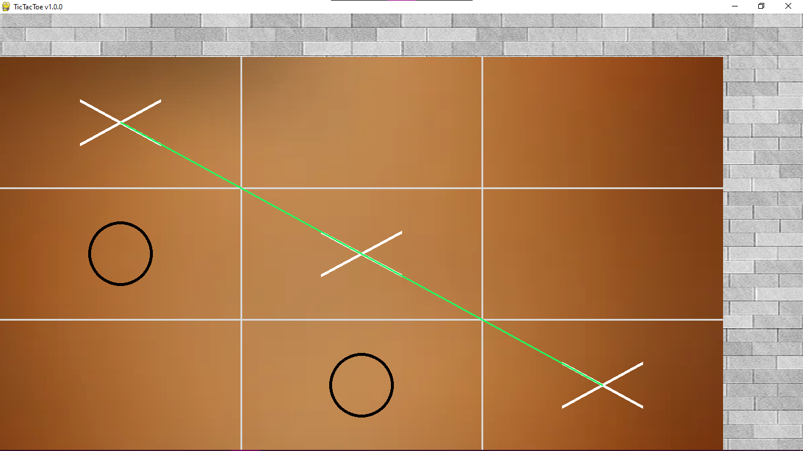
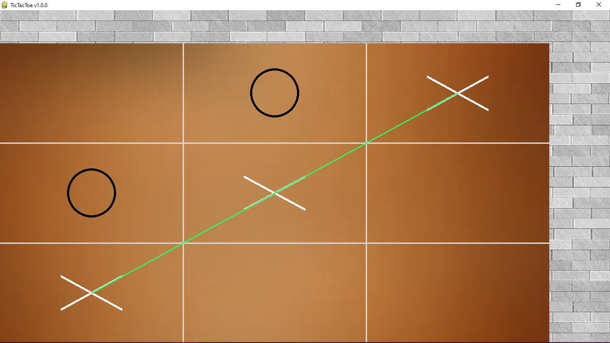
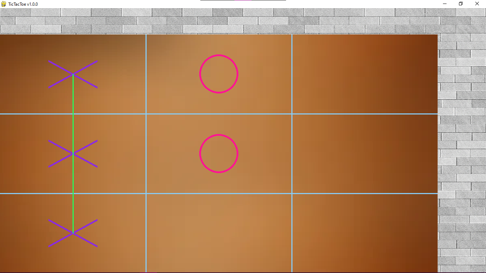
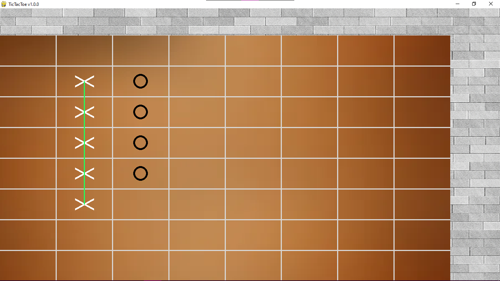

# 🕹 TicTacToe
A customizable TicTacToe built with Python and PyGame's library


## 🖼 Galery
|                                     |                                     |
|-------------------------------------|-------------------------------------|
|  |  |
|  |  |


## 🌎 Technologies Used

- Python
- PyGame


## 📋 Installation

```bash
1. Clone the repository
git clone https://github.com/FabricioDosSantosMoreira/TicTacToe.git


2. Install the dependencies
make install

# Or use:
pip install poetry
poetry install


3. Start the game
make run

# Or use:
cd './TicTacToe/'
poetry run python main.py
```

## ⚙ Custom settings

You can customize the gaming starting settings inside `TicTacToe/configs.json`


## ⚙ Game keys 

Press key 'R' to restart the game with the current configurations.

Press key 'N' to start a new game with the default settings.

Press keys '1' to '0' to start a new game with predefined custom configurations.

## 💡 Contribution

Feel free to contribute with any suggestions, corrections or tips. Just open a pull request!


## 📃 License

The project is licensed under the MIT License. See the [LICENSE](LICENSE/) for more information.
